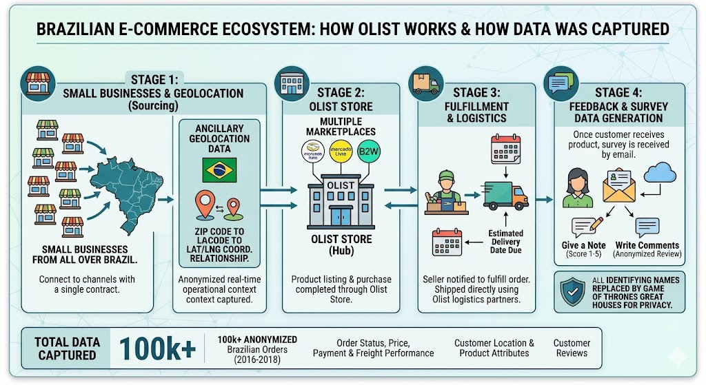
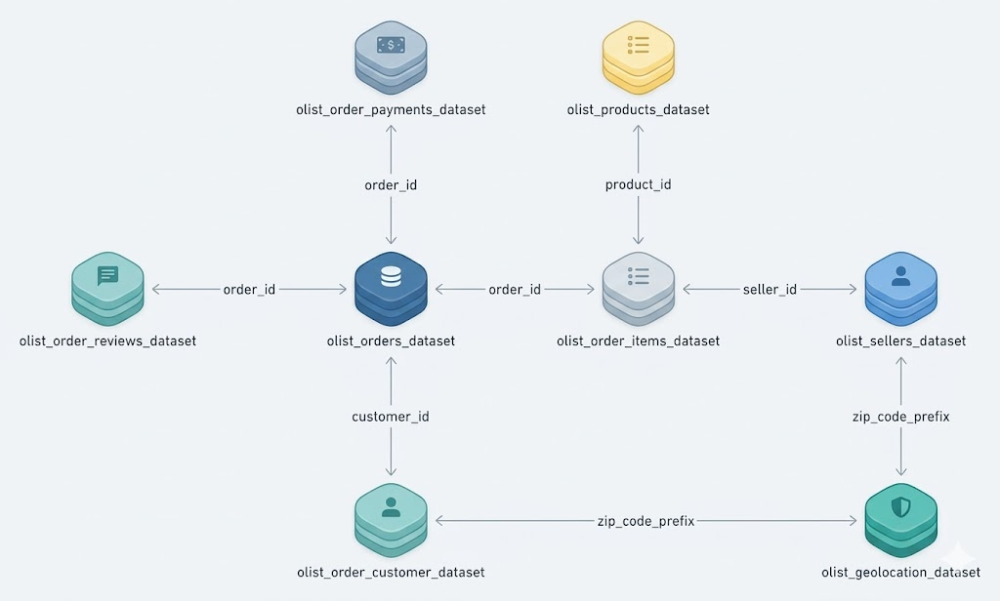

# Olist Delivery Delay Prediction

**Predicting late deliveries in Brazilian e-commerce before they happen.**



---

## Team

| Name               |
| ------------------ |
| _Aman Abuelayyan_  |
| _Ameed Aburub_     |
| _Dalah Hashlamoon_ |
| _Ruaa Luay_        |
| _Sura Sammour_     |

---

## Problem & Goal

**Late deliveries** damage customer trust, inflate support costs, and drive negative reviews. On the Olist marketplace, roughly **8% of delivered orders arrive after the promised date** — and those orders disproportionately receive 1–2 star reviews.

**Business question:** _Can we predict whether an order will be delivered late, before it ships, so Olist can proactively manage at-risk orders?_

**Stakeholders:** Olist operations team, logistics partners, and marketplace sellers.

**Goals set in the proposal:**

| Task                                              | Target                   | Result                |
| ------------------------------------------------- | ------------------------ | --------------------- |
| Classification — predict `is_late`                | ROC-AUC > 0.80           | **0.80 ✅**           |
| Regression — predict `delay_gap` (days late)      | RMSE < 2 days, R² > 0.60 | RMSE 7.66, R² 0.44 ❌ |
| Risk Score — combine both into a priority ranking | Proof-of-concept         | **Delivered ✅**      |

> The classification target was met. The regression targets were ambitious and not reached — delivery delay in days is inherently noisy and hard to pin down precisely. See [Limitations](#limitations--ethics) below.

---

## Data

**Source:** [Brazilian E-Commerce Public Dataset by Olist](https://www.kaggle.com/datasets/olistbr/brazilian-ecommerce) (Kaggle)

The dataset contains **~100k orders** placed on the Olist marketplace between 2016 and 2018, spread across 9 relational tables.

| Table                | Rows      | One row represents                 |
| -------------------- | --------- | ---------------------------------- |
| orders               | 99,441    | One unique order                   |
| order_items          | 112,650   | One item within an order           |
| order_payments       | 103,886   | One payment transaction            |
| order_reviews        | 99,224    | One customer review                |
| customers            | 99,441    | One customer (per order)           |
| sellers              | 3,095     | One seller                         |
| products             | 32,951    | One product                        |
| geolocation          | 1,000,163 | One lat/lng record per zip code    |
| category_translation | 71        | Portuguese → English category name |



**Key limitations:**

- All identifying names are anonymized (replaced with Game of Thrones house names).
- Review scores are collected _after_ delivery — they cannot be used as model features.
- Geolocation has multiple coordinate entries per zip code (aggregated to centroids).
- After cleaning and scope filtering to delivered orders only: **96,455 rows** retained.

---

## Approach

The project follows a five-notebook pipeline:

```
NB01  Data Understanding & Cleaning
  ↓   Fix types, handle missing values, flag anomalies, create target variable
NB02  Data Merging
  ↓   Join 9 tables → one-row-per-order dataset (96,455 × 38)
NB03  Exploratory Data Analysis
  ↓   Distribution, correlation, geographic, temporal, and seller analysis
NB04  Feature Engineering
  ↓   54 features: seller metrics, haversine distance, temporal, log transforms
NB05  Supervised Modelling
      Classification + Regression + Risk Score
```

**Key design decisions:**

- **Time-based train/test split** (oldest 80% train, newest 20% test) to simulate real deployment.
- **Bottleneck seller** defined as the seller with the latest shipping limit per order — they are the rate-limiting factor in multi-seller orders.
- **Haversine distance** between seller and customer zip code centroids, driven by the EDA finding that geography is the strongest delay signal.
- **Class imbalance** handled via `class_weight='balanced'` / `scale_pos_weight`, evaluated with F1 and ROC-AUC (not accuracy).

---

## Results

### Classification (predict `is_late`)

| Model               | Test ROC-AUC | Train-Test Gap | Status       |
| ------------------- | ------------ | -------------- | ------------ |
| Logistic Regression | 0.726        | +0.005 ✅      | Baseline     |
| Random Forest       | 0.756        | +0.050 ⚠️      |              |
| XGBoost             | 0.800        | +0.051 ⚠️      |              |
| **XGBoost (Tuned)** | **0.800**    | **+0.082 ⚠️**  | **Selected** |

### Regression (predict `delay_gap` in days)

| Model               | Test RMSE | Test R²   | Train-Test Gap (R²) |
| ------------------- | --------- | --------- | ------------------- |
| Linear Regression   | 8.60      | 0.293     | +0.061 ⚠️           |
| Random Forest       | 7.92      | 0.400     | +0.022 ✅           |
| XGBoost             | 7.73      | 0.429     | +0.033 ✅           |
| **XGBoost (Tuned)** | **7.66**  | **0.439** | **+0.114 ❌**       |

### Risk Score

A combined metric multiplying late probability × predicted delay × order value weight, giving operations teams a single number to prioritize interventions.

### Key Visuals

**Target imbalance:** 91.9% on-time vs 8.1% late (11:1 ratio). A naive baseline of "always predict on-time" already hits ~92% accuracy — the model must beat this using F1 and AUC.

**Geography matters most:** States in Brazil's North and Northeast show 2–3× the late rate of Southeastern states, where most sellers are concentrated. Haversine distance became a top feature.

**Physical features correlate with delays:** Heavier, bulkier orders (furniture, home appliances) show the highest late rates — weight, volume, and freight are strong pre-shipment predictors.

**Temporal spikes:** Late delivery rate spikes during holiday seasons (Black Friday, December), suggesting logistics capacity constraints.

---

## Conclusion

**What we learned:**

- Delivery delays are predictable from pre-shipment information, especially **seller-customer distance**, **estimated delivery buffer**, and **physical product characteristics**.
- XGBoost achieved the classification target (ROC-AUC = 0.80) but the regression task is inherently harder — predicting the exact number of days late requires more granular logistics data.
- The Risk Score framework provides a practical way to prioritize at-risk orders for intervention.

**What we would do next:**

- Add real-time seller performance features (computed only on historical data, not full-dataset leakage).
- Incorporate weather and carrier-level data for more precise delay estimation.
- Deploy the Risk Score as an operational dashboard for the logistics team.
- Apply SHAP explainability to surface per-order reasons for high risk.

---

## How to Run

### Google Colab (recommended)

1. Upload the `assets/data/raw/` CSV files from the [Kaggle dataset](https://www.kaggle.com/datasets/olistbr/brazilian-ecommerce) to your Google Drive.
2. Open each notebook in order (`01` → `05`). Update the `DATA_PATH` variable to point to your Drive folder.
3. Run all cells sequentially — each notebook saves its outputs for the next.

### Local

```bash
pip install pandas numpy matplotlib seaborn scikit-learn xgboost
jupyter notebook
```

Run notebooks in order. Ensure `assets/data/raw/` contains the Kaggle CSVs.

---

## Limitations & Ethics

- **Data leakage risk:** `seller_late_rate_smooth` was computed on the full dataset. In production, this must use only historical (past) orders to avoid look-ahead bias.
- **Class imbalance:** At 8% late rate, the model's precision for the late class is low (~23%). This means many flagged orders will actually arrive on time — acceptable for proactive outreach, but not for punitive actions against sellers.
- **Geographic bias:** The model may systematically flag orders to remote regions. Care should be taken not to disadvantage customers or sellers in underserved areas.
- **Anonymization:** Customer and seller identities are already anonymized in the dataset. No personal data is exposed.
- **Temporal scope:** Data covers 2016–2018. Logistics infrastructure and Olist's operations may have changed significantly since then.

---

## Repository Structure

```
├── 01_data_understanding_cleaning.ipynb   # Load, inspect, clean raw data
├── 02_merge_dataset.ipynb                 # Join tables → order-level dataset
├── 03_eda.ipynb                           # Exploratory data analysis
├── 04_feature_engineering.ipynb           # Build 54 model-ready features
├── 05_supervised_modelling.ipynb          # Train, tune, evaluate models
├── assets/
│   ├── data/raw/                          # Original Kaggle CSVs (not tracked)
│   ├── data/cleaned/                      # Output of NB01
│   ├── data/merged/                       # Output of NB02
│   ├── data/features/                     # Output of NB04
│   ├── olist_data_schema.jpg
│   ├── olist_flow.jpg
│   └── product_listing_example.png
├── README.md                              # This file
├── PROPOSAL.md                            # Project proposal
└── notebooks/                             # Per-notebook READMEs
    ├── README_01_cleaning.md
    ├── README_02_merging.md
    ├── README_03_eda.md
    ├── README_04_features.md
    └── README_05_modelling.md
```

---

## Credits

- **Dataset:** [Olist](https://www.kaggle.com/datasets/olistbr/brazilian-ecommerce) — released under CC BY-NC-SA 4.0
- **Libraries:** pandas, scikit-learn, XGBoost, matplotlib, seaborn
